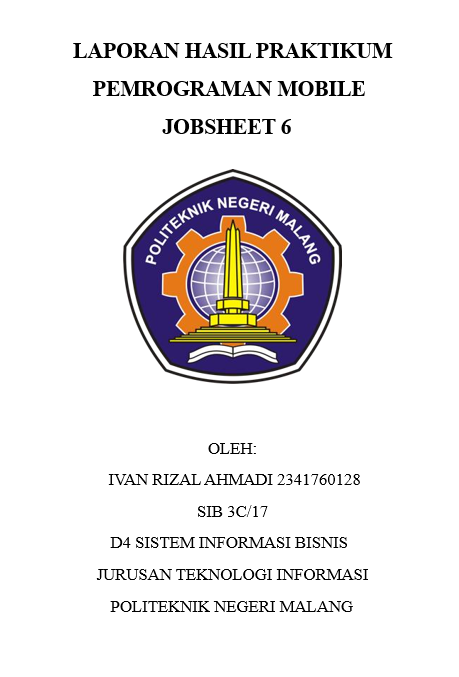
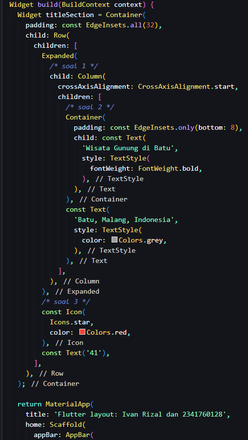
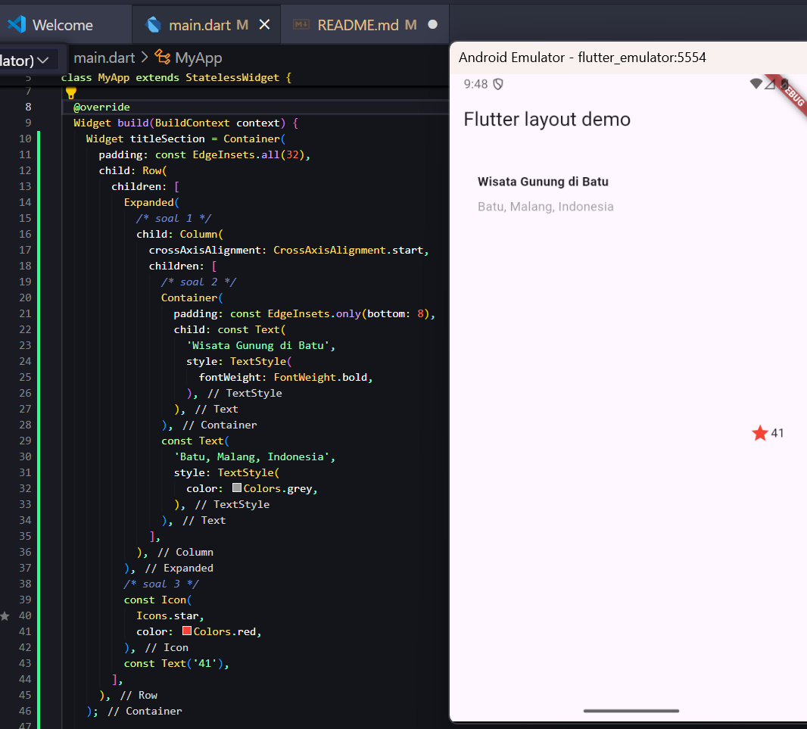
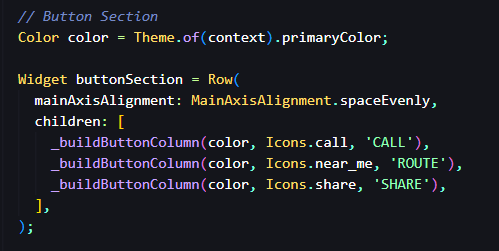
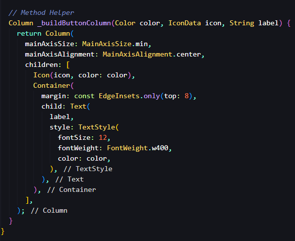
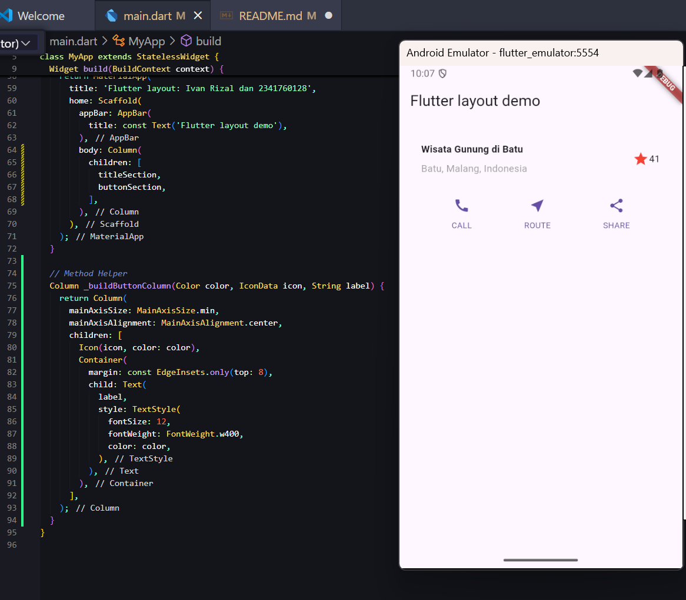

# 📱 Flutter Layout – Jobsheet 6

Project ini merupakan hasil praktikum Flutter tentang **Layout** menggunakan widget dasar seperti `Row`, `Column`, `Expanded`, `Container`, `Text`, dan `Icon`.

# 📄 Praktikum 1: Layout

Row + Expanded + Column
Row digunakan untuk menyusun widget secara horizontal.
Expanded agar Column menyesuaikan ruang yang tersisa.
Column menampilkan teks judul dan lokasi.
Soal 1: crossAxisAlignment: CrossAxisAlignment.start -> membuat teks rata kiri.
Soal 2: Teks judul dibungkus Container dengan padding: EdgeInsets.only(bottom: 8) -> memberi jarak. Lokasi diberi warna abu-abu (Colors.grey).
Soal 3: Tambahkan Icon(Icons.star, color: Colors.red) dan teks "41" di sisi kanan.

Untuk output nya adalah sebagai berikut:

# 📄 Praktikum 2: Implementasi Button Row

Pada praktikum ini saya menambahkan baris tombol (button row) di bawah title section. Baris tombol berisi 3 buah kolom dengan tata letak yang sama:
Sebuah ikon
Sebuah teks di bawah ikon
Karena bentuknya sama, maka dibuat sebuah method helper bernama _buildButtonColumn() yang menerima parameter:
color → warna teks dan ikon
icon → ikon yang ditampilkan
label → teks di bawah ikon

Soal 1: Mengapa dibuat method _buildButtonColumn?
Supaya kode lebih rapi dan tidak perlu menulis berulang kali untuk setiap tombol.
Metode ini mengembalikan sebuah Column yang berisi ikon dan teks.

Soal 2: Bagaimana cara memberi jarak antara ikon dan teks?
Teks diletakkan di dalam Container dengan margin: EdgeInsets.only(top: 8).
Margin ini memberi jarak 8 piksel di atas teks, sehingga teks tidak menempel dengan ikon.

Soal 3: Bagaimana cara meratakan tombol di dalam baris?
Baris tombol dibuat dengan Row().
Properti mainAxisAlignment: MainAxisAlignment.spaceEvenly digunakan agar semua kolom diberi jarak yang sama di sepanjang baris.

Untuk output nya sebagai berikut

A few resources to get you started if this is your first Flutter project:

- [Lab: Write your first Flutter app](https://docs.flutter.dev/get-started/codelab)
- [Cookbook: Useful Flutter samples](https://docs.flutter.dev/cookbook)

For help getting started with Flutter development, view the
[online documentation](https://docs.flutter.dev/), which offers tutorials,
samples, guidance on mobile development, and a full API reference.
