# 📱 Flutter Layout – Jobsheet 6  

Project ini merupakan hasil praktikum Flutter tentang **Layout** menggunakan widget dasar seperti `Row`, `Column`, `Expanded`, `Container`, `Text`, dan `Icon`.

---

## 📄 Praktikum 1: Layout  

### 🔹 Penjelasan:
- `Row` digunakan untuk menyusun widget secara horizontal.  
- `Expanded` membuat `Column` menyesuaikan ruang yang tersisa.  
- `Column` menampilkan teks judul dan lokasi.  

**Soal 1:**  
`crossAxisAlignment: CrossAxisAlignment.start` → membuat teks rata kiri.  

**Soal 2:**  
Teks judul dibungkus `Container` dengan `padding: EdgeInsets.only(bottom: 8)` → memberi jarak antar teks.  
Lokasi diberi warna abu-abu (`Colors.grey`).  

**Soal 3:**  
Tambahkan `Icon(Icons.star, color: Colors.red)` dan teks `"41"` di sisi kanan.  

**Output:**

---

## 📄 Praktikum 2: Implementasi Button Row  

### 🔹 Penjelasan:
Pada praktikum ini ditambahkan baris tombol (button row) di bawah title section.  
Terdapat **3 buah kolom** dengan tata letak yang sama:
1. Sebuah ikon  
2. Sebuah teks di bawah ikon  

Agar efisien, dibuat **method helper** bernama `_buildButtonColumn()` dengan parameter:
- `color` → warna teks dan ikon  
- `icon` → ikon yang ditampilkan  
- `label` → teks di bawah ikon  

### ❓ Pertanyaan:
**Soal 1:** Mengapa dibuat method `_buildButtonColumn`?  
➡ Supaya kode lebih rapi dan tidak perlu menulis berulang kali untuk setiap tombol.

**Soal 2:** Bagaimana cara memberi jarak antara ikon dan teks?  
➡ Teks diletakkan di dalam `Container` dengan `margin: EdgeInsets.only(top: 8)`.

**Soal 3:** Bagaimana cara meratakan tombol di dalam baris?  
➡ Gunakan `Row()` dengan `mainAxisAlignment: MainAxisAlignment.spaceEvenly`.

**Output:**

---

## 📘 Praktikum 3: Implementasi Text Section  

Membuat variabel `textSection` yang berisi `Container` dengan `padding` sebesar **32** di semua sisi.  
Di dalamnya terdapat widget `Text` dengan properti `softWrap: true`.

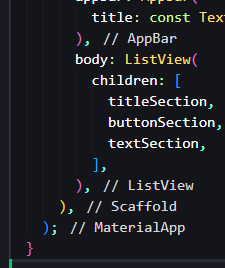

Kemudian masukkan `textSection` ke dalam `ListView` di bagian body, setelah `buttonSection`.

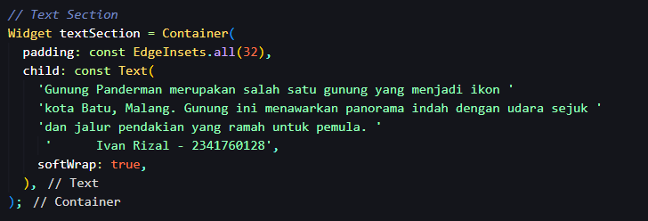

**Output:**
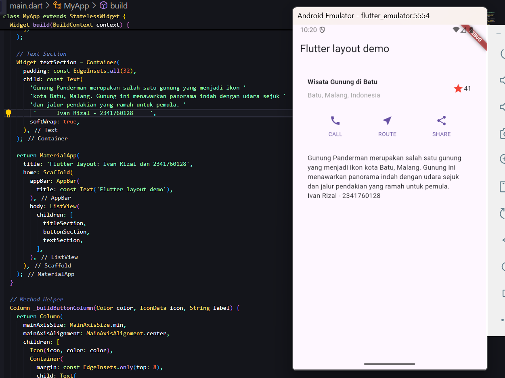

---

## 🖼️ Praktikum 4: Image Section  

Langkah awal:
- Modifikasi file `pubspec.yaml` agar bisa mengambil gambar dari folder `assets/images`.
- Tambahkan gambar dan atur layout pada `main.dart`.

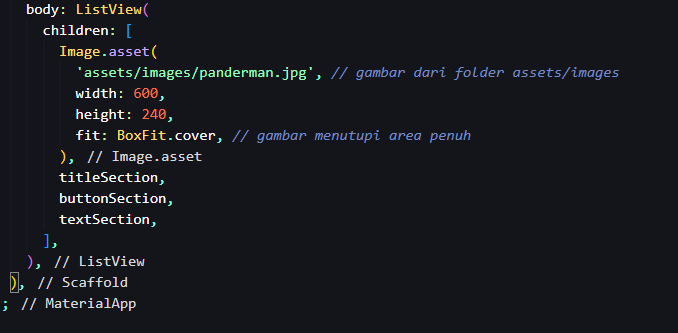

**Output Akhir:**
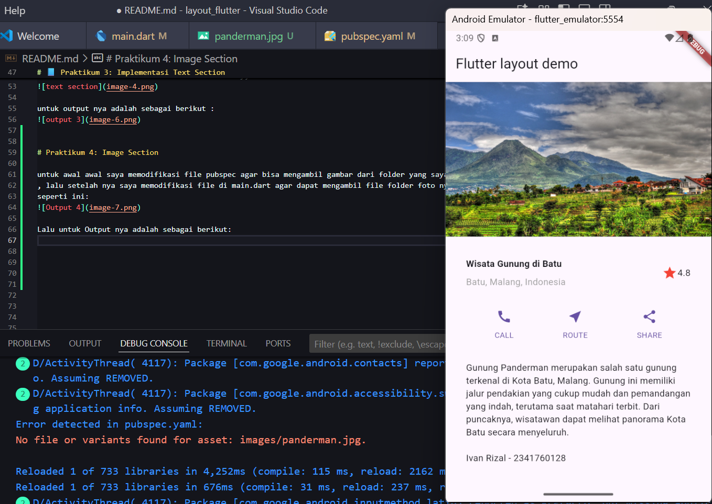

---

## 🧩 Praktikum 5: Struktur Folder dan Navigasi  

### 📂 Membuat Struktur Folder
Buat folder:
- `models` → untuk model data  
- `pages` → untuk halaman `HomePage` dan `ItemPage`

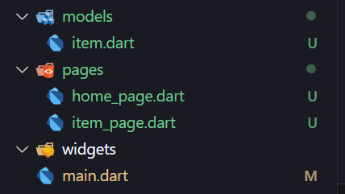

### 🧱 Membuat Model Data  
File: `lib/models/item.dart`  
Class `Item` berisi atribut `name` dan `price` sebagai representasi barang.  

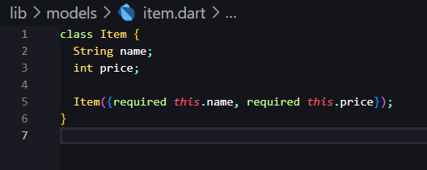

### 🏠 Membuat Halaman HomePage  
File: `lib/pages/home_page.dart`  
Menampilkan daftar barang menggunakan `ListView.builder()`.  
Setiap item menampilkan nama dan harga barang.  
Klik item → menuju halaman detail dengan `Navigator.pushNamed()`.

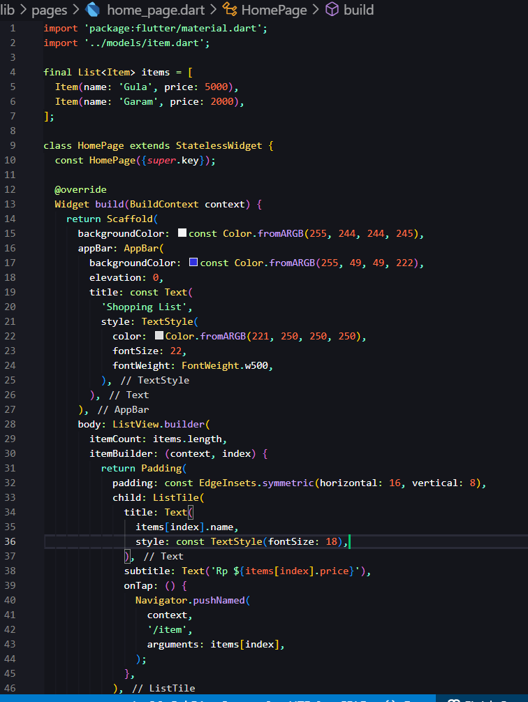

### 📄 Membuat Halaman ItemPage  
File: `lib/pages/item_page.dart`  
Halaman ini menerima data dari HomePage melalui `arguments`, lalu menampilkan detail nama dan harga.

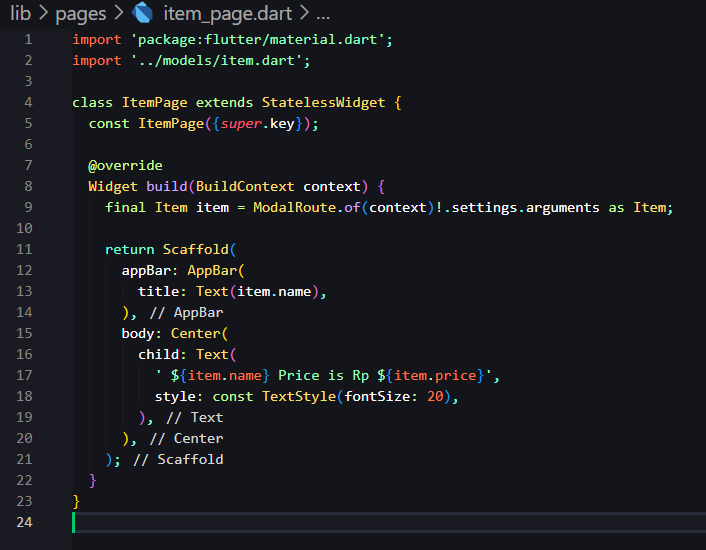

### 🚀 Menentukan Rute Navigasi  
File: `lib/main.dart`  
Menentukan `initialRoute` dan `routes` untuk menghubungkan halaman `'/'` (HomePage) dan `'/item'` (ItemPage).

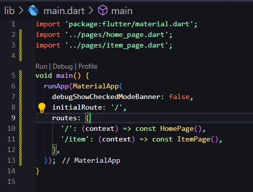

**Output:**
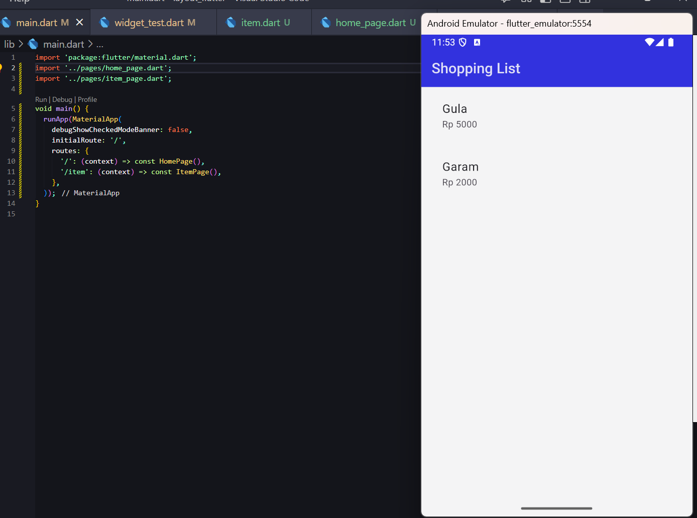

Ketika item diklik, diarahkan ke halaman detail:
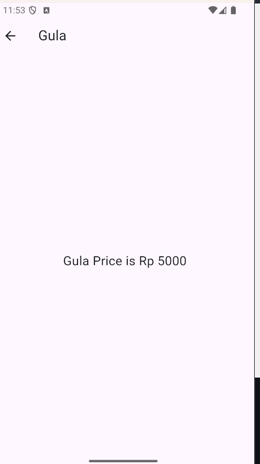
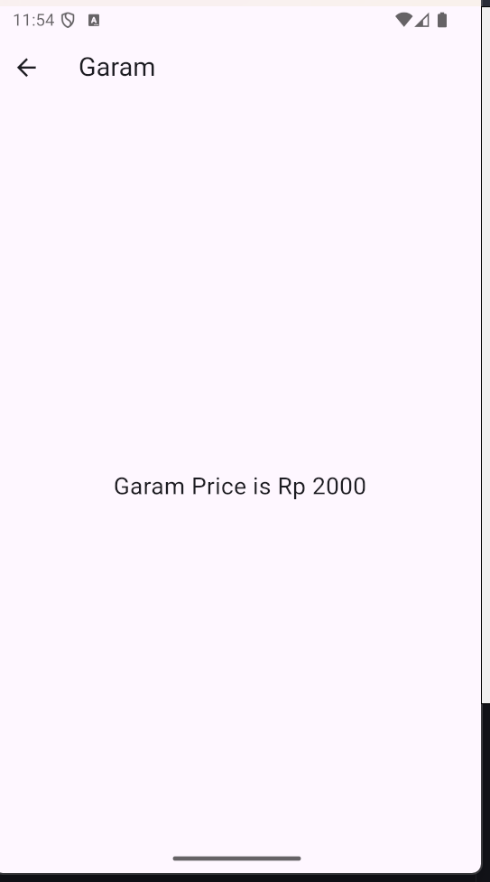

---

## 🛒 Tugas Praktikum 2: Aplikasi Belanja Flutter  

### 📂 Struktur Folder  
Struktur folder dan file sama seperti praktikum sebelumnya:  
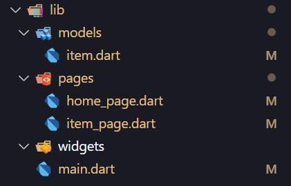

### 🖼️ Menambahkan Gambar di pubspec.yaml  
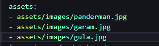

### 🧱 Membuat Model Data  
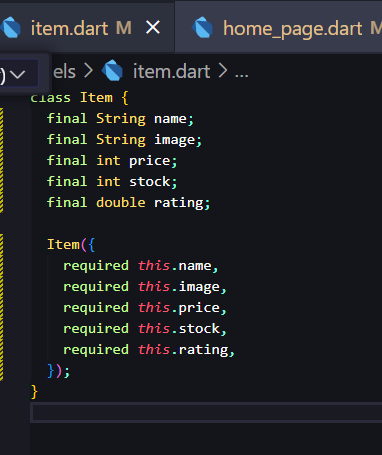

### 🏠 Membuat Halaman Home  
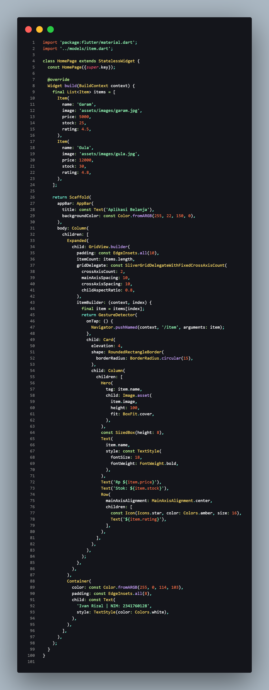

### 📄 Membuat Halaman Item  
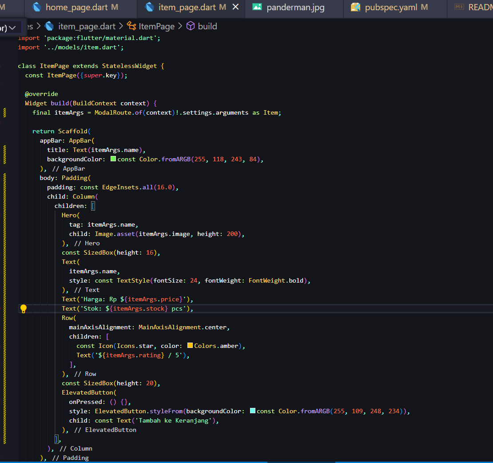

### 🧭 Mengatur Navigasi dan Route  
File `main.dart` mengimpor halaman `item` dan `home`, serta mengatur route.  
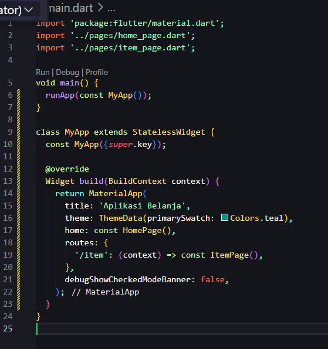

### ✨ Menambahkan Hero Animation  
Hero animation ditambahkan di HomePage dan ItemPage:  
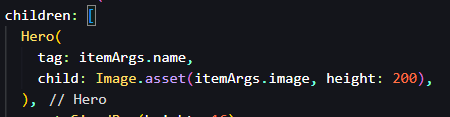

Efek ini membuat gambar berpindah dengan animasi halus saat produk ditekan.

### 📱 Output:
Tampilan halaman utama aplikasi belanja:  
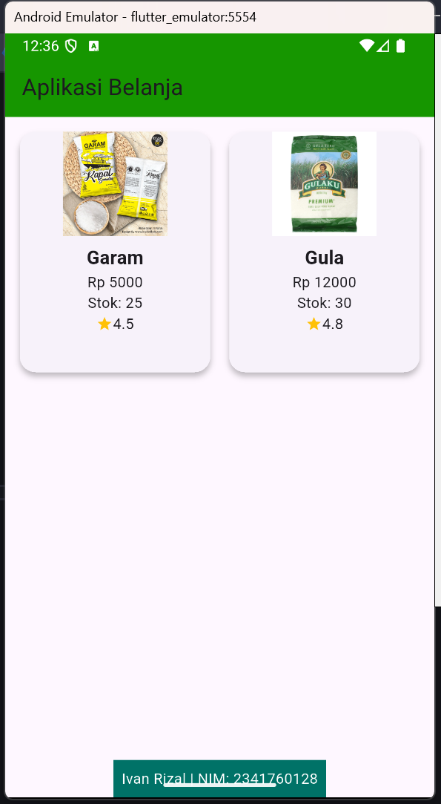

Ketika produk diklik:
#### 🧂 Produk Garam  
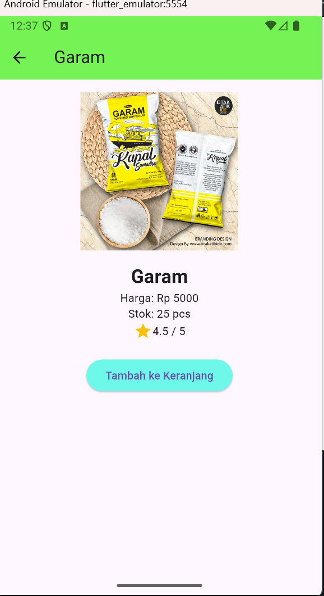

#### 🍬 Produk Gula  
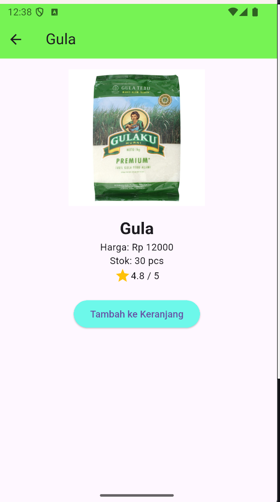

---

## 📚 Referensi  
- [Flutter Documentation](https://docs.flutter.dev)  
- [Cookbook: Useful Flutter Samples](https://docs.flutter.dev/cookbook)  
- [Codelab: Write Your First Flutter App](https://docs.flutter.dev/get-started/codelab)

---

**🧾 Disusun oleh:**  
👤 **Ivan Rizal**  
💻 **Politeknik Negeri Malang – Sistem Informasi Bisnis**  
📅 **Tahun: 2025**  
